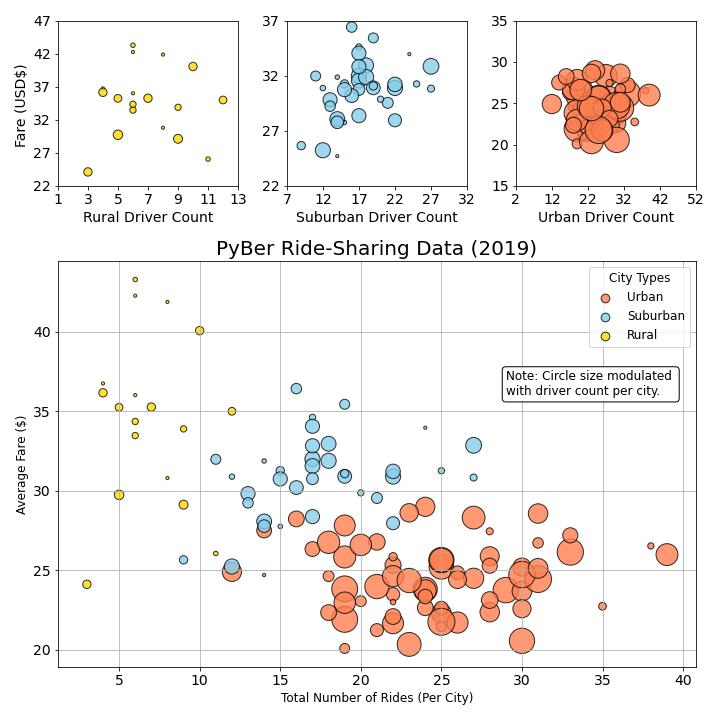
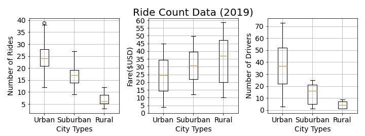
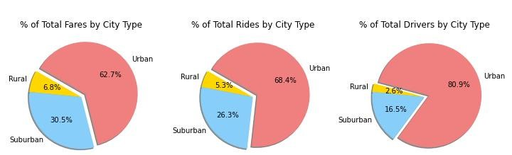
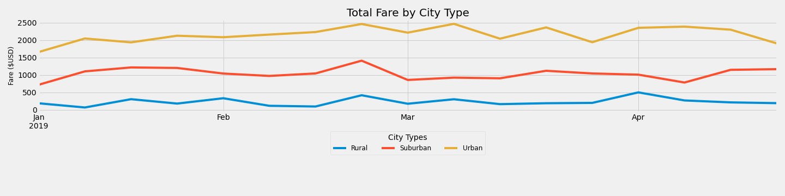

# PyBer_Analysis
## Project Overview
The overall task of this project was to provide exploratory data analysis and visualization on a mock dataset of ride-share data from January to early May of 2019. To visualize the distribution of these data, bubble charts, box and whisker plots, and pie charts were made that broke down the data into three city types: urban, suburban, and rural (Figures 1, 2, &3). Some insight gained from this preliminary analysis was that:

- The driver count is greatest in urban cities, smaller in suburban and rural with some overlap in the average fare price between them. Overall, the rural cities have higher fares per ride and urban cities have lower fares per ride (Figure 1).
- The average number of rides in rural cities is about 4- and 3.5-times lower per city than the urban and suburban cities, respectively (Figure 2).
- The average fare for rides in the rural cities is about $11 and $5 more per ride than the urban and suburban cities, respectively (Figure 2).
- The average number of drivers in rural cities is nine to four times less per city than in urban and suburban cities, respectively (Figure 2).
- The urban cities make up 62.7% and 68.4% of the total fares and total rides respectively; and account for 80.9% of the number of drivers (Figure 3).
- Suburban cities account for 30.5% and 26.3% of the total fares and total rides respectively; and 16.5% of the number of drivers (Figure 3).
- Rural areas account for 6.8% and 5.3% of the total fares and total rides respectively; and only 2.6% of the number of drivers (Figure 3).

#### Figure 1. Bubble plots showing the average fares of each city type for the driver counts and total number of rides.


#### Figure 2. Box and whisker plots of the distribution of number of rides, fares, and number of drivers in each city type


#### Figure 3. Pie charts showing the percentage of total fares, total rides, and total drivers by city type


### Resources Used
- Data : 
 - Resources/city_data.csv
 - Resources/ride_data.csv
- Software: Python 3.7.6, Pandas 1.3.5, NumPy 1.20.3, SciPy 1.7.3

## Overview of the Analysis
Gathering together a summary of the ride-share metrics, a DataFrame was produced to highlight the following: 
- Total Rides	
- Total Drivers	
- Total Fares	
- Average Fare per Ride	
- Average Fare per Driver.

The code to obtain these metrics from the dataset and generate the resulting DataFrame are shown below.

Adding a layer of time in to the analysis to understand how the total weekly fares for each city type varied over a given amount of time, a line chart was produced (Figure 4). The code to replicate this analysis is shown below along with Figure 4.

### Deliverable 1:

```python
#  1. Get the total rides for each city type
ride_count = pyber_data_df.groupby(["type"]).count()["ride_id"]
 
# 2. Get the total drivers for each city type
total_driver_count = city_data_df.groupby(["type"]).sum()["driver_count"]

#  3. Get the total amount of fares for each city type
fares = pyber_data_df.groupby(["type"]).sum()["fare"]


#  4. Get the average fare per ride for each city type. 
avg_fare_per_ride = fares.divide(ride_count)
print(avg_fare_per_ride)

# 5. Get the average fare per driver for each city type. 
avg_fare_per_driver = fares.divide(total_driver_count)

#  6. Create a PyBer summary DataFrame. 
pyber_summary_df = pd.DataFrame({
    "Total Rides" : ride_count,
    "Total Drivers" : total_driver_count,
    "Total Fares" : fares,
    "Average Fare per Ride" : avg_fare_per_ride,
    "Average Fare per Driver" : avg_fare_per_driver
})

#  7. Cleaning up the DataFrame. Delete the index name
pyber_summary_df.index.name = None

#  8. Format the columns.
pyber_summary_df["Total Fares"] = pyber_summary_df["Total Fares"].map("${:,.2f}".format)
pyber_summary_df["Average Fare per Ride"] = pyber_summary_df["Average Fare per Ride"].map("${:.2f}".format)
pyber_summary_df["Average Fare per Driver"] = pyber_summary_df["Average Fare per Driver"].map("${:.2f}".format)

pyber_summary_df
```

### Deliverable #2
```python
# 1. Using groupby() to create a new DataFrame showing the sum of the fares 
#  for each date where the indices are the city type and date.
fares_sum_per_date = pyber_data_df.groupby(["type", "date"]).sum()["fare"]
fares_sum_per_date_df = pd.DataFrame(fares_sum_per_date)
fares_sum_per_date_df

# 2. Reset the index on the DataFrame you created in #1. This is needed to use the 'pivot()' function.
fares_sum_per_date_df = fares_sum_per_date_df.reset_index()
fares_sum_per_date_df

# 3. Create a pivot table with the 'date' as the index, the columns ='type', and values='fare' 
# to get the total fares for each type of city by the date. 
date_fares_pivot = fares_sum_per_date_df.pivot(index="date", columns="type", values="fare")

# 4. Create a new DataFrame from the pivot table DataFrame using loc on the given dates, '2019-01-01':'2019-04-28'.
jantoapr_df = date_fares_pivot.loc['2019-01-01':'2019-04-28']

# 5. Set the "date" index to datetime datatype. This is necessary to use the resample() method in Step 8.
jantoapr_df.index = pd.to_datetime(jantoapr_df.index)

# 6. Check that the datatype for the index is datetime using df.info()
jantoapr_df.info()

# 7. Create a new DataFrame using the "resample()" function by week 'W' and get the sum of the fares for each week.
weeks_df = jantoapr_df.resample('W').sum()
weeks_df
```
#### *DataFrame showing the total fares for each city type given a week in the specified duration to be used for plotting*
- This is the data source for the multiple line plot generated in the code block below
<table border="1" class="dataframe">
  <thead>
    <tr style="text-align: right;">
      <th>type</th>
      <th>Rural</th>
      <th>Suburban</th>
      <th>Urban</th>
    </tr>
    <tr>
      <th>date</th>
      <th></th>
      <th></th>
      <th></th>
    </tr>
  </thead>
  <tbody>
    <tr>
      <th>2019-01-06</th>
      <td>187.92</td>
      <td>721.60</td>
      <td>1661.68</td>
    </tr>
    <tr>
      <th>2019-01-13</th>
      <td>67.65</td>
      <td>1105.13</td>
      <td>2050.43</td>
    </tr>
    <tr>
      <th>2019-01-20</th>
      <td>306.00</td>
      <td>1218.20</td>
      <td>1939.02</td>
    </tr>
    <tr>
      <th>2019-01-27</th>
      <td>179.69</td>
      <td>1203.28</td>
      <td>2129.51</td>
    </tr>
    <tr>
      <th>2019-02-03</th>
      <td>333.08</td>
      <td>1042.79</td>
      <td>2086.94</td>
    </tr>
    <tr>
      <th>2019-02-10</th>
      <td>115.80</td>
      <td>974.34</td>
      <td>2162.64</td>
    </tr>
    <tr>
      <th>2019-02-17</th>
      <td>95.82</td>
      <td>1045.50</td>
      <td>2235.07</td>
    </tr>
    <tr>
      <th>2019-02-24</th>
      <td>419.06</td>
      <td>1412.74</td>
      <td>2466.29</td>
    </tr>
    <tr>
      <th>2019-03-03</th>
      <td>175.14</td>
      <td>858.46</td>
      <td>2218.20</td>
    </tr>
    <tr>
      <th>2019-03-10</th>
      <td>303.94</td>
      <td>925.27</td>
      <td>2470.93</td>
    </tr>
    <tr>
      <th>2019-03-17</th>
      <td>163.39</td>
      <td>906.20</td>
      <td>2044.42</td>
    </tr>
    <tr>
      <th>2019-03-24</th>
      <td>189.76</td>
      <td>1122.20</td>
      <td>2368.37</td>
    </tr>
    <tr>
      <th>2019-03-31</th>
      <td>199.42</td>
      <td>1045.06</td>
      <td>1942.77</td>
    </tr>
    <tr>
      <th>2019-04-07</th>
      <td>501.24</td>
      <td>1010.73</td>
      <td>2356.70</td>
    </tr>
    <tr>
      <th>2019-04-14</th>
      <td>269.79</td>
      <td>784.82</td>
      <td>2390.72</td>
    </tr>
    <tr>
      <th>2019-04-21</th>
      <td>214.14</td>
      <td>1149.27</td>
      <td>2303.80</td>
    </tr>
    <tr>
      <th>2019-04-28</th>
      <td>191.85</td>
      <td>1169.04</td>
      <td>1909.51</td>
    </tr>
  </tbody>
</table>
</div>

### Generate a multiple line plot showing the total fares for each city type through the time duration specified above.
```python
# 8. Using the object-oriented interface method, plot the resample DataFrame using the df.plot() function. 

# Import the style from Matplotlib.
from matplotlib import style
# Use the graph style fivethirtyeight.
style.use('fivethirtyeight')

fig = plt.figure()
ax = weeks_df.plot(figsize = (20,5))

plt.title("Total Fare by City Type", fontsize=20)
plt.ylabel("Fare ($USD)", fontsize=12)
plt.xlabel("")

lgnd = ax.legend(fontsize="12", mode="Expanded", title="City Types", ncol=3, loc='lower center',
                 bbox_to_anchor=(0.5, -0.5))
lgnd.get_title().set_fontsize(14)


plt.tight_layout()
plt.savefig("Analysis/PyBer_fare_summary.png")

```

## Results

### Deliverable #1 Result
<table border="1" class="dataframe">
  <thead>
    <tr style="text-align: right;">
      <th></th>
      <th>Total Rides</th>
      <th>Total Drivers</th>
      <th>Total Fares</th>
      <th>Average Fare per Ride</th>
      <th>Average Fare per Driver</th>
    </tr>
  </thead>
  <tbody>
    <tr>
      <th>Rural</th>
      <td>125</td>
      <td>78</td>
      <td>$4,327.93</td>
      <td>$34.62</td>
      <td>$55.49</td>
    </tr>
    <tr>
      <th>Suburban</th>
      <td>625</td>
      <td>490</td>
      <td>$19,356.33</td>
      <td>$30.97</td>
      <td>$39.50</td>
    </tr>
    <tr>
      <th>Urban</th>
      <td>1625</td>
      <td>2405</td>
      <td>$39,854.38</td>
      <td>$24.53</td>
      <td>$16.57</td>
    </tr>
  </tbody>
</table>
</div>

### Deliverable #2 Result
Conclusions that can be drawn from the summary DataFrame are:
1. The total number of rides taken in urban cities is 6x greater than in suburban cities and 13x greater than in rural cities.
2. The total number of drivers in urban cities is nearly 5x greater than in suburban cities and nearly 31x greater than in rural cities.
3. In terms of the total revenue from fares, the urban cities make up 62.7%, Suburban cities account for 30.5% and Rural areas account for 6.8%.
4. The average fare between all three city types only has a difference of about $10.00. There are no data for trip distance by city type, but it could be assumed that the higher average fare per ride in rural areas are due to longer transportation distance, while the lowest fare per ride in urban areas would be due to shorter transportation distance. The average fare per ride is $26.75 (almost the fare per ride of urban cities, though these rides make up a significant chunk of the distribution) but the standard deviation is $12.11. These metrics indicate that there is no observable difference between the price per ride between the city types. 
5. Depending on cost of gas and transportation time for the drivers, it appears that it pays well to be a driver in the rural areas with the average fare per driver of $55.49. This is 3.48x greater than a driver in an urban area can make per ride. Alternatively, being a driver in an urban area may provide more abundant opportunity to ride requests, and shorter time commitments per ride, allowing for this difference in fare per ride between rural and urban to be nonexistent and enabling the driver to be more selective of which ride requests they respond to. To understand the revenue given a total week of work that a driver could make, it is best to reference the line plot in Figure 4.

Conclusions that can be drawn from the line plot in Figure 4:
To attempt to draw inferences on which city type is best to be a PyBer driver in, the line plot shows the total revenue on a weekly basis over a 4-month span of time. The urban area drivers make more money any given week than their suburban and rural counterparts. Rural drivers make the least amount of money. These totals only reflect the total amount of fares and a better figure to address the average total weekly fare per driver would be best to get at this question. Interestingly, there appear to be some weeks in which rural drivers generate very little in the total fares. This suggests maybe only one or two rides in a given week for those drivers based on the average fare per ride of $55.49.

##### Figure . Multiple Line Chart 


## Summary
The overall higher demand for ride-sharing in urban areas has led a a large disparity in the total revenue of fares when compared to those of the suburban and urban areas. A potential factor which may shed more light on this and allow for fare adjustment due to travel time and or travel distance would be to collect that data from each ride to be able to analyze it alongside the previously calculated metrics. The overall weekly revenue of an urban PyBer driver may discourage others from becoming a driver in rural areas. This may result in a ride availability issues. The law of demand says that at higher prices, buyers will demand less of an economic good. Conversely, the law of supply says that at higher prices, sellers will supply more of an economic good. As this applies to the PyBer data, fare adjustment based on the number of rides and types of rides (short vs long) in a given city type may encourage even more ride-sharing among the population.
