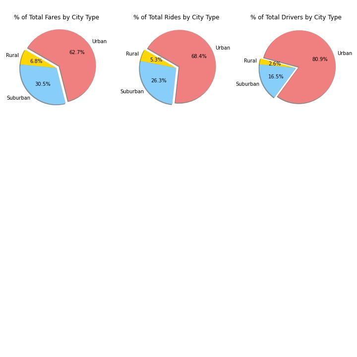

# PyBer_Analysis
## Project Overview
The overall task of this project was to do do exploratory data analysis and visualization on a mock dataset of ride share data from January to early May of 2019. To visualize the distribution of these data bubble charts, box and whisker plots, and pie charts were made that broke down the data into three city types: urban, suburban, and rural (Figures 1, 2, &3). 

#### Figure 1. Buble plots showing the average fares of each city type for the driver counts and total number of rides.


#### Figure 2. Box and whisker plots of the distribution of number of rides, fares, and number of drivers in each city type


#### Pie charts showing...


### Resources Used

## Overview of the Analysis
### Deliverable 1:

```python
#  1. Get the total rides for each city type
ride_count = pyber_data_df.groupby(["type"]).count()["ride_id"]
 
# 2. Get the total drivers for each city type
total_driver_count = city_data_df.groupby(["type"]).sum()["driver_count"]

#  3. Get the total amount of fares for each city type
fares = pyber_data_df.groupby(["type"]).sum()["fare"]


#  4. Get the average fare per ride for each city type. 
avg_fare_per_ride = fares.divide(ride_count)
print(avg_fare_per_ride)

# 5. Get the average fare per driver for each city type. 
avg_fare_per_driver = fares.divide(total_driver_count)

#  6. Create a PyBer summary DataFrame. 
pyber_summary_df = pd.DataFrame({
    "Total Rides" : ride_count,
    "Total Drivers" : total_driver_count,
    "Total Fares" : fares,
    "Average Fare per Ride" : avg_fare_per_ride,
    "Average Fare per Driver" : avg_fare_per_driver
})

#  7. Cleaning up the DataFrame. Delete the index name
pyber_summary_df.index.name = None

#  8. Format the columns.
pyber_summary_df["Total Fares"] = pyber_summary_df["Total Fares"].map("${:,.2f}".format)
pyber_summary_df["Average Fare per Ride"] = pyber_summary_df["Average Fare per Ride"].map("${:.2f}".format)
pyber_summary_df["Average Fare per Driver"] = pyber_summary_df["Average Fare per Driver"].map("${:.2f}".format)

pyber_summary_df
```

### Deliverable #2
```python
# 1. Using groupby() to create a new DataFrame showing the sum of the fares 
#  for each date where the indices are the city type and date.
fares_sum_per_date = pyber_data_df.groupby(["type", "date"]).sum()["fare"]
fares_sum_per_date_df = pd.DataFrame(fares_sum_per_date)
fares_sum_per_date_df

# 2. Reset the index on the DataFrame you created in #1. This is needed to use the 'pivot()' function.
fares_sum_per_date_df = fares_sum_per_date_df.reset_index()
fares_sum_per_date_df

# 3. Create a pivot table with the 'date' as the index, the columns ='type', and values='fare' 
# to get the total fares for each type of city by the date. 
date_fares_pivot = fares_sum_per_date_df.pivot(index="date", columns="type", values="fare")

# 4. Create a new DataFrame from the pivot table DataFrame using loc on the given dates, '2019-01-01':'2019-04-28'.
jantoapr_df = date_fares_pivot.loc['2019-01-01':'2019-04-28']

# 5. Set the "date" index to datetime datatype. This is necessary to use the resample() method in Step 8.
jantoapr_df.index = pd.to_datetime(jantoapr_df.index)

# 6. Check that the datatype for the index is datetime using df.info()
jantoapr_df.info()

# 7. Create a new DataFrame using the "resample()" function by week 'W' and get the sum of the fares for each week.
weeks_df = jantoapr_df.resample('W').sum()
weeks_df
```
#### *DataFrame showing the total fares for each city type given a week in the specified duration*
- This is the data source for the multiple line plot generated in the code block below
<table border="1" class="dataframe">
  <thead>
    <tr style="text-align: right;">
      <th>type</th>
      <th>Rural</th>
      <th>Suburban</th>
      <th>Urban</th>
    </tr>
    <tr>
      <th>date</th>
      <th></th>
      <th></th>
      <th></th>
    </tr>
  </thead>
  <tbody>
    <tr>
      <th>2019-01-06</th>
      <td>187.92</td>
      <td>721.60</td>
      <td>1661.68</td>
    </tr>
    <tr>
      <th>2019-01-13</th>
      <td>67.65</td>
      <td>1105.13</td>
      <td>2050.43</td>
    </tr>
    <tr>
      <th>2019-01-20</th>
      <td>306.00</td>
      <td>1218.20</td>
      <td>1939.02</td>
    </tr>
    <tr>
      <th>2019-01-27</th>
      <td>179.69</td>
      <td>1203.28</td>
      <td>2129.51</td>
    </tr>
    <tr>
      <th>2019-02-03</th>
      <td>333.08</td>
      <td>1042.79</td>
      <td>2086.94</td>
    </tr>
    <tr>
      <th>2019-02-10</th>
      <td>115.80</td>
      <td>974.34</td>
      <td>2162.64</td>
    </tr>
    <tr>
      <th>2019-02-17</th>
      <td>95.82</td>
      <td>1045.50</td>
      <td>2235.07</td>
    </tr>
    <tr>
      <th>2019-02-24</th>
      <td>419.06</td>
      <td>1412.74</td>
      <td>2466.29</td>
    </tr>
    <tr>
      <th>2019-03-03</th>
      <td>175.14</td>
      <td>858.46</td>
      <td>2218.20</td>
    </tr>
    <tr>
      <th>2019-03-10</th>
      <td>303.94</td>
      <td>925.27</td>
      <td>2470.93</td>
    </tr>
    <tr>
      <th>2019-03-17</th>
      <td>163.39</td>
      <td>906.20</td>
      <td>2044.42</td>
    </tr>
    <tr>
      <th>2019-03-24</th>
      <td>189.76</td>
      <td>1122.20</td>
      <td>2368.37</td>
    </tr>
    <tr>
      <th>2019-03-31</th>
      <td>199.42</td>
      <td>1045.06</td>
      <td>1942.77</td>
    </tr>
    <tr>
      <th>2019-04-07</th>
      <td>501.24</td>
      <td>1010.73</td>
      <td>2356.70</td>
    </tr>
    <tr>
      <th>2019-04-14</th>
      <td>269.79</td>
      <td>784.82</td>
      <td>2390.72</td>
    </tr>
    <tr>
      <th>2019-04-21</th>
      <td>214.14</td>
      <td>1149.27</td>
      <td>2303.80</td>
    </tr>
    <tr>
      <th>2019-04-28</th>
      <td>191.85</td>
      <td>1169.04</td>
      <td>1909.51</td>
    </tr>
  </tbody>
</table>
</div>

### Generate a multiple line plot showing the the total fares for each city type through the time duration specified above.
```python
# 8. Using the object-oriented interface method, plot the resample DataFrame using the df.plot() function. 

# Import the style from Matplotlib.
from matplotlib import style
# Use the graph style fivethirtyeight.
style.use('fivethirtyeight')

fig = plt.figure()
ax = weeks_df.plot(figsize = (20,5))

plt.title("Total Fare by City Type", fontsize=20)
plt.ylabel("Fare ($USD)", fontsize=12)
plt.xlabel("")

lgnd = ax.legend(fontsize="12", mode="Expanded", title="City Types", ncol=3, loc='lower center',
                 bbox_to_anchor=(0.5, -0.5))
lgnd.get_title().set_fontsize(14)


plt.tight_layout()
plt.savefig("Analysis/PyBer_fare_summary.png")

```

## Results

### Deliverable #1 Result
<table border="1" class="dataframe">
  <thead>
    <tr style="text-align: right;">
      <th></th>
      <th>Total Rides</th>
      <th>Total Drivers</th>
      <th>Total Fares</th>
      <th>Average Fare per Ride</th>
      <th>Average Fare per Driver</th>
    </tr>
  </thead>
  <tbody>
    <tr>
      <th>Rural</th>
      <td>125</td>
      <td>78</td>
      <td>$4,327.93</td>
      <td>$34.62</td>
      <td>$55.49</td>
    </tr>
    <tr>
      <th>Suburban</th>
      <td>625</td>
      <td>490</td>
      <td>$19,356.33</td>
      <td>$30.97</td>
      <td>$39.50</td>
    </tr>
    <tr>
      <th>Urban</th>
      <td>1625</td>
      <td>2405</td>
      <td>$39,854.38</td>
      <td>$24.53</td>
      <td>$16.57</td>
    </tr>
  </tbody>
</table>
</div>

### Deliverable #2 Result

##### Figure . Multiple Line Chart 


## Summary
